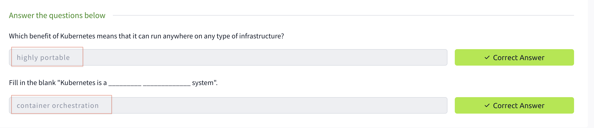
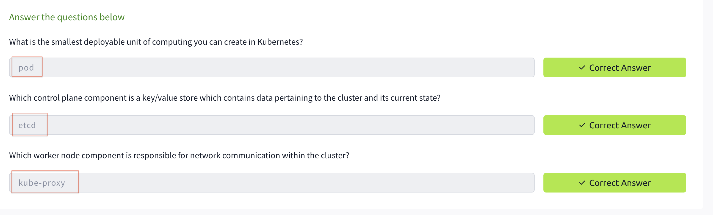
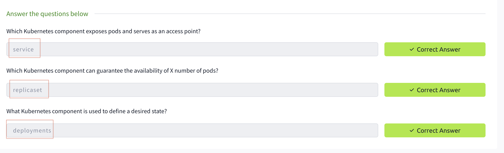
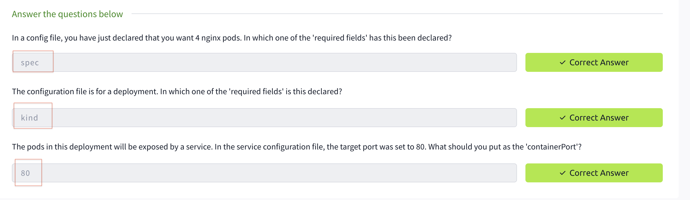
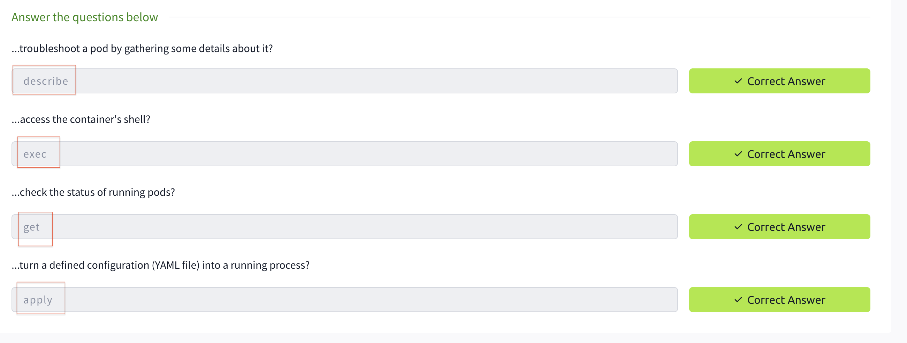
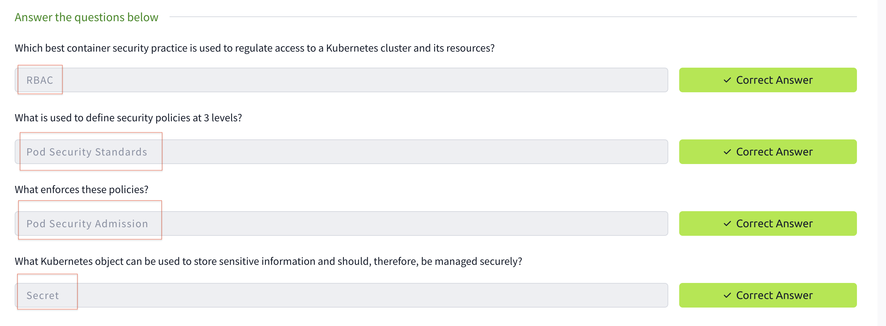
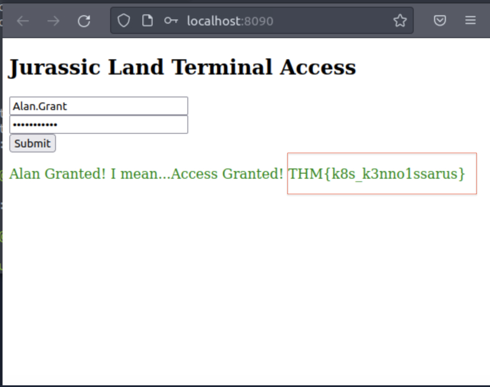
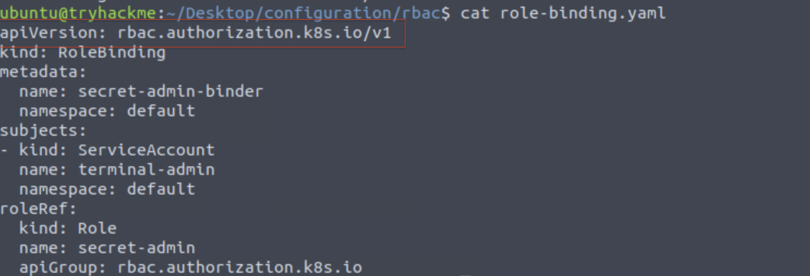
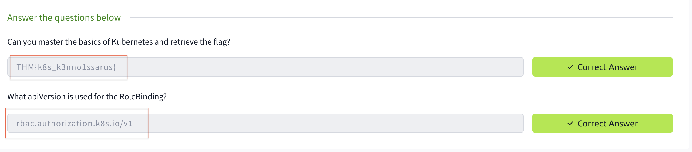

# Intro-to-Kubernetes

I completed the Kubernetes course on TryHackMe. I explored the following topics:

✅ Cluster Architecture (Kubernetes Pod, Kubernetes Nodes, Kubernetes Cluster)

✅ Kubernetes Control Plane (Kube-apiserver, Etcd, Kube-scheduler, Kube-controller-manager, Cloud-controller-manager)

✅ Kubernetes Worker Node (Kubelet, Kube-proxy, Container runtime)

✅ Kubernetes Landscape (Namespaces, ReplicaSet, Deployments, StatefulSets, Services, Ingress)

✅ Kubernetes Configuration (apiVersion, kind, metadata, spec)

✅ Kubectl (Kubectl apply, Kubectl get, Kubectl describe, Kubectl logs, Kubectl exec, Kubectl port-forward)

✅ Kubernetes Security (RBAC, Secrets Management, Pod Security Admission, Pod Security Standards)

## Task2 Correct Answer

## Task3 Correct Answer

## Task4 Correct Answer

## Task5 Correct Answer

## Task6 Correct Answer

## Task7 Correct Answer

## Finding the answer to task 8–1

## Finding the answer to task 8–2

## Task8 Correct Answer

